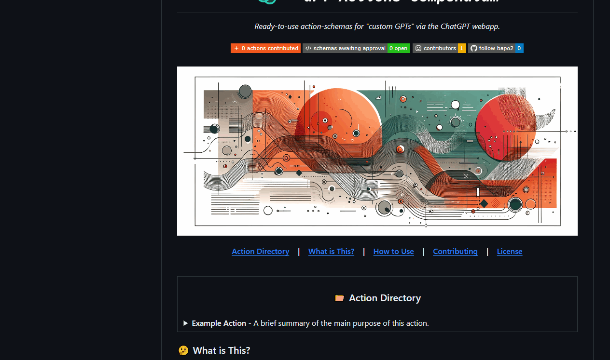

<h1 align="center">🚧 REPO SETUP STILL IN PROGRESS, PLEASE BE PATIENT</h1>

<!-- Header -->
<h1 align="center">
    <picture>
        <source media="(prefers-color-scheme: dark)" srcset="./header-dark.svg">
        <source media="(prefers-color-scheme: light)" srcset="./header-light.svg">
        
    </picture>
</h1>
<p align="center">
    <i align="center">Ready-to-use action-schemas for "custom GPTs" via the ChatGPT webapp.</i>
</p>

<!-- Badges -->
<h4 align="center">
    <a href="https://github.com/bapo2/gpt-actions/issues/new?assignees=&labels=new-schema&projects=&template=new_action_template.yml&title=%5BNew+GPT+Action%5D%3A+">
        
    </a>
    <a href="https://github.com/bapo2/gpt-actions/issues?q=is%3Aissue+is%3Aopen+label%3Aschema-valid+">
        
    </a>
    <a href="https://github.com/bapo2/gpt-actions/graphs/contributors">
        
    </a>
    <a href="https://github.com/bapo2">
        
    </a>
<h4>

<!-- Banner -->
<h4 align="center">
    
</h4>

<!-- Section Links -->
<p align="center">
    <b>
        <a href="#-action-directory">Action Directory</a>
        &nbsp;&nbsp;&nbsp;|&nbsp;&nbsp;&nbsp;
        <a href="#-what-is-this">What is This?</a>
        &nbsp;&nbsp;&nbsp;|&nbsp;&nbsp;&nbsp;
        <a href="#-how-to-use">How to Use</a>
        &nbsp;&nbsp;&nbsp;|&nbsp;&nbsp;&nbsp;
        <a href="#-contributing">Contributing</a>
    </b>
</p>
<br>

<!-- Action Directory -->
<table>
<thead><tr><th width="9999px"><h2 align="center">📁 Action Directory</h2></th></tr></thead>
<tbody>
<!-- START_SCHEMA_DIRECTORY -->

<!-- START_SCHEMA: "New action" -->
<tr><td><details><summary><b>New action</b> - A short description of the new action.</summary><p><ul>
<li><b>Author:</b> <a href="https://github.com/bapo2">bapo2</a></li>
<li><b>Schema format:</b> JSON</li>
<li><b>Authentication type:</b> No authentication</li></ul></p>
<p><b>Description:</b><br>
<i>This is a longer description of the action and will be placed in the dropdown entry.

This can be multiline!</i></p>
<p><b>Import URL:</b><br>

```
https://raw.githubusercontent.com/bapo2/gpt-actions/main/schemas/new-action/schema.json
```
</p><p><b>Schema:</b>

```json
{
    "openapi": "3.1.0",
    "info": {
        "title": "Get weather data",
        "description": "Retrieves current weather data for a location.",
        "version": "v1.0.0"
    },
    "servers": [
        {
            "url": "https://weather.example.com"
        }
    ],
    "paths": {
        "/location": {
            "get": {
                "description": "Get temperature for a specific location",
                "operationId": "GetCurrentWeather",
                "parameters": [
                    {
                        "name": "location",
                        "in": "query",
                        "description": "The city and state to retrieve the weather for",
                        "required": true,
                        "schema": {
                            "type": "string"
                        }
                    }
                ],
                "deprecated": false
            }
        }
    },
    "components": {
        "schemas": {}
    }
}
```
</p></details></td></tr>
<!-- END_SCHEMA: "New action" -->
<tr></tr>

<!-- START_SCHEMA: "New schema yaml" -->
<tr><td><details><summary><b>New schema yaml</b> - This is a new schea in yaml format</summary><p><ul>
<li><b>Author:</b> <a href="https://github.com/bapo2">bapo2</a></li>
<li><b>Schema format:</b> YAML</li>
<li><b>Authentication type:</b> API Key [Basic]</li></ul></p>
<p><b>Description:</b><br>
<i>Here is another description.

And it's multiline too!

Words!</i></p>
<p><b>Import URL:</b><br>

```
https://raw.githubusercontent.com/bapo2/gpt-actions/main/schemas/new-schema-yaml/schema.yaml
```
</p><p><b>Schema:</b>

```yaml
# Taken from https://github.com/OAI/OpenAPI-Specification/blob/main/examples/v3.0/petstore.yaml

openapi: "3.0.0"
info:
  version: 1.0.0
  title: Swagger Petstore
  license:
    name: MIT
servers:
  - url: https://petstore.swagger.io/v1
paths:
  /pets:
    get:
      summary: List all pets
      operationId: listPets
      tags:
        - pets
      parameters:
        - name: limit
          in: query
          description: How many items to return at one time (max 100)
          required: false
          schema:
            type: integer
            maximum: 100
            format: int32
      responses:
        '200':
          description: A paged array of pets
          headers:
            x-next:
              description: A link to the next page of responses
              schema:
                type: string
          content:
            application/json:    
              schema:
                $ref: "#/components/schemas/Pets"
        default:
          description: unexpected error
          content:
            application/json:
              schema:
                $ref: "#/components/schemas/Error"
    post:
      summary: Create a pet
      operationId: createPets
      tags:
        - pets
      responses:
        '201':
          description: Null response
        default:
          description: unexpected error
          content:
            application/json:
              schema:
                $ref: "#/components/schemas/Error"
  /pets/{petId}:
    get:
      summary: Info for a specific pet
      operationId: showPetById
      tags:
        - pets
      parameters:
        - name: petId
          in: path
          required: true
          description: The id of the pet to retrieve
          schema:
            type: string
      responses:
        '200':
          description: Expected response to a valid request
          content:
            application/json:
              schema:
                $ref: "#/components/schemas/Pet"
        default:
          description: unexpected error
          content:
            application/json:
              schema:
                $ref: "#/components/schemas/Error"
components:
  schemas:
    Pet:
      type: object
      required:
        - id
        - name
      properties:
        id:
          type: integer
          format: int64
        name:
          type: string
        tag:
          type: string
    Pets:
      type: array
      maxItems: 100
      items:
        $ref: "#/components/schemas/Pet"
    Error:
      type: object
      required:
        - code
        - message
      properties:
        code:
          type: integer
          format: int32
        message:
          type: string
```
</p></details></td></tr>
<!-- END_SCHEMA: "New schema yaml" -->

<!-- END_SCHEMA_DIRECTORY -->
</tbody>
</table>

<!-- Description -->
## 🤔 What is This?

This repository is meant as a compendium of action-schemas for [ChatGPT's](https://chat.openai.com/) "custom GPT" feature, which allows users to implement highly customizable API function-calls into their prompt-tuned instances of GPT, letting it perform a wide variety of tasks using request to said APIs. This is accomplished by providing the model with an OpenAPI-spec compliant schema (in either JSON or YAML format) that describes the API call(s) to be made in detail, including the request body, headers, and query parameters, as well as the expected response body and status code (if need be). The model then uses this schema to generate a request to the API, and returns the response body as its output, which it can then use in completions as context for the task being performed.

This feature is extremely powerful, and can be used to perform a wide variety of tasks, from simple things like getting the weather or searching for a video on YouTube, to more complex tasks like creating and managing a GitHub repository programmatically. See the [official ChatGPT docs](https://platform.openai.com/docs/actions) for more information on how this feature works. **In essence, anything accessible via an API can be interacted with by the model using this feature, with virtually no limitations on what can be done.**

In the interest of building a community around this incredibly versatile feature, and to allow for the development of more capable and powerful actions to equip GPT with, I created this repository as a place for users to share their action-schemas publicly, so that others can use them in their own "custom GPTs", and so that they can be improved upon iteratively by the community as a whole. **If you have an action-schema you'd like to share, please consider contributing it to this repository!** See the [contributing](#-contributing) section for more information on how to do so.

<!-- How to Use -->
## 📖 How to Use

<h4 align="center">
    
</h4>

To use an action from this repository, simply copy the import URL of the action you'd like to use, and **paste it into the "Import from URL" field** in the "Add actions" section of the ChatGPT webapp's "Create a GPT" panel. After this, you can test the action by either prompting the model to use it or by clicking "Test" next to the `path` you wish to test. If the action is working properly, you should see a status indicator that the model is querying the appropriate endpoint, after which it will show if the action was successful or not.

> [!NOTE]
> If you are using an action that requires authentication, you will need to provide the appropriate credentials in the "Authentication" section of the "Add actions" panel. If applicable, the instructions for this will be included in the action's description (if not, please open an issue on this repository requesting that the author add them).

<!-- Contributing -->
## 🤝 Contributing

*If you'd like to contribute an action-schema to this repository, please follow the steps below:*

1. **[Submit a new schema for approval](https://github.com/bapo2/gpt-actions/issues/new?assignees=&labels=new-schema&projects=&template=new_action_template.yml&title=%5BNew+GPT+Action%5D%3A+) by filling out the template provided.** This will aid you in creating a new issue for the schema you wish to contribute, and will ensure that all the necessary information is provided for the schema to be approved and added to the repository.
2. **The schema will be automatically validated by a GitHub workflow,** ensuring that all required information is provided and that the schema is syntactically valid according to what is required by the respective format accepted by the ChatGPT webapp.
3. **If the schema is valid and all required information is provided, it will be marked for manual review.** This is to ensure that the schema is not malicious, otherwise harmful, or breaks any of the rules outlined in the repo's [code of conduct.](./CODE_OF_CONDUCT.md)
4. **Once the schema has manually been reviewed and approved by a repository maintainer, it will be marked for inclusion.** This means that, at the next PR triggered by workflow dispatch, the schema will be added to the repository among the other existing entries. PRs for this repository are structured as batches of all schemas that have been marked for inclusion since the last PR. This is so that the repository is updated in bulk rather than one schema at a time and so that we can keep track of the number of schemas that have been contributed to the repository. **This is done fairly often, so you shouldn't have to wait long for your schema to be added to the repository.**

> [!TIP]
> If the schema is not valid, the workflow will attempt to provide a sufficiently descriptive error message to help you fix the issue, at which point you can simply edit the issue to fix the problem and the workflow will re-run automatically.

*If you'd like to [contribute to the repository](https://docs.github.com/en/get-started/exploring-projects-on-github/contributing-to-a-project) in other ways, such as by improving the documentation, adding new features, or fixing bugs in the workflows, please feel free to submit a PR:*

1. **[Fork the repository.](https://github.com/bapo2/gpt-actions/fork)** This will create a copy of the repository under your own account, which you can then make changes to. You only need to copy the default branch, `main`.
2. **Make the changes you'd like to contribute.** This can be done either directly on GitHub or by cloning the repository to your local machine and making the changes there.
3. **[Submit a pull request.](https://github.com/bapo2/gpt-actions/compare)** This will open a new PR, which will be reviewed by a repository maintainer. If the changes are approved, they will be merged into the repository at an appropriate time as not to conflict with automated workflows.